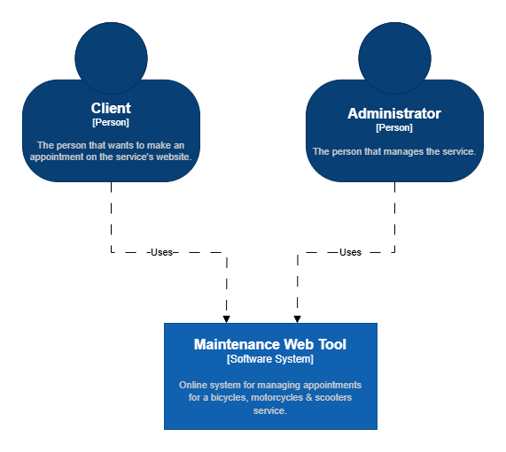
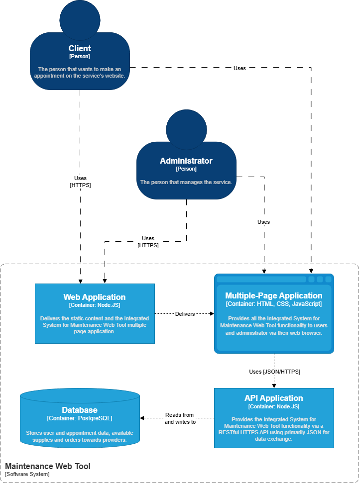
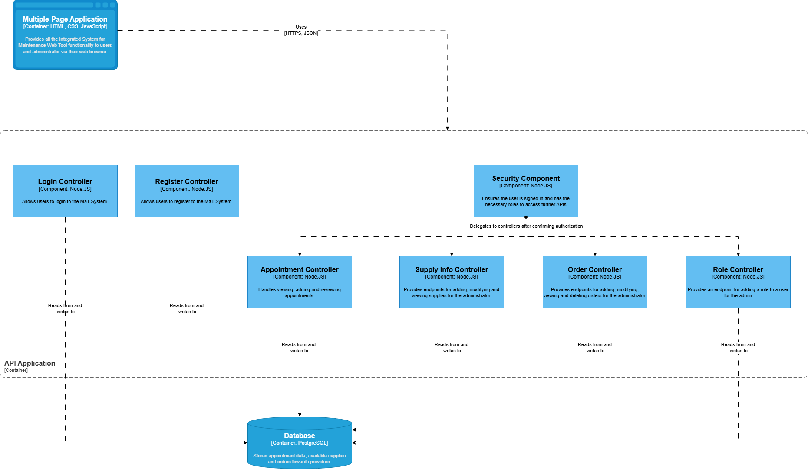

<div align="center">

  
  <h1>Maintenance Web Tool</h1>
  
  <p>
    Web Technologies project by Focsa Ionut-Madalin & Dutescu Daniela. 
  </p>
  
  
<!-- Badges -->
<p>
  <a href="https://github.com/MadalinTheGrey/MaT_TitireziiZburatori">
    
  </a>
  <a href="https://github.com/MadalinTheGrey/MaT_TitireziiZburatori/network/members">
    
  </a>
  <a href="https://github.com/MadalinTheGrey/MaT_TitireziiZburatori/stargazers">
    
  </a>
  <a href="https://github.com/MadalinTheGrey/MaT_TitireziiZburatori/issues/">
    
  </a>
</p>
   
<h4>
    <a href="https://github.com/MadalinTheGrey/MaT_TitireziiZburatori/">View Demo</a>
  <span> · </span>
    <a href="https://github.com/MadalinTheGrey/MaT_TitireziiZburatori">Documentation</a>
  <span> · </span>
    <a href="https://github.com/MadalinTheGrey/MaT_TitireziiZburatori/issues/">Report Bug</a>
  <span> · </span>
    <a href="https://github.com/MadalinTheGrey/MaT_TitireziiZburatori/issues/">Request Feature</a>
  </h4>
</div>

<br />

<!-- Table of Contents -->

# :notebook_with_decorative_cover: Table of Contents

- [About the Project](#star2-about-the-project)
  - [Project Architecture](#project-architecture)
  - [Frontend](#frontend)
  - [Backend](#backend)
  - [Tech Stack](#space_invader-tech-stack)
  - [Features](#dart-features)
  - [Color Reference](#art-color-reference)
  - [Environment Variables](#key-environment-variables)
- [Getting Started](#toolbox-getting-started)
  - [Prerequisites](#bangbang-prerequisites)
  - [Installation](#gear-installation)
  - [Running Tests](#test_tube-running-tests)
  - [Run Locally](#running-run-locally)
  - [Deployment](#triangular_flag_on_post-deployment)
- [Usage](#eyes-usage)
- [Roadmap](#compass-roadmap)
- [FAQ](#grey_question-faq)
- [License](#warning-license)
- [Contact](#handshake-contact)
- [Acknowledgements](#gem-acknowledgements)

<!-- About the Project -->

## :star2: About the Project

### Project architecture

**C4 Level 1 Diagram**

<div align="center">
  
</div>

**C4 Level 2 Diagram**

<div align="center">
  
</div>

**C4 Level 3 Diagram**

<div align="center">
  
</div>

### Front-end

**General info**


The front-end represets an implementation of the MaT(Maintenance Web Tool) web application, a platform dedicated to maintenance and repair services for motorcycles, bicycles and scooters.
The primary goal of the front-end is to provide an intuitive and aesthetically pleasing interface for users, showcasing the services offered, facilitating contact, and subsequently, managing user accounts. 

*Technologies Used*:
 - HTML5: Semantic structure for web pages.
 - CSS3: Visual styles, responsive layout.
 - JavaScript: Client-side interactivity, DOM manipulation, API calls.


**Project Structure**

The frontend project is organized in a modular fashion, separating files by their functionality on page (homepage, admin, client, login, register) for improved readability and maintainability.

*Naming conventions:*
 - CSS/JS Files: kebab-case (e.g., login.js, default.css)
 - CSS Classes: kebab-case (e.g., .hero-section, .service-card)
 - HTML IDs: camelCase or kebab-case (e.g., #searchByName, #contact-footer)
 - JavaScript Variables: camelCase (e.g., isLoggedIn, userRole)

Every folder is composed from several files, each serving a part of the functionality of each page that can be found in the web application. Every page is built from several semantic sections, each serving a specific role in presenting information.

The structure can be seen right there:
```
/public/
    /Adminpage/
        /adminpage.html
        /adminpage.css
        /adminpage.js
    /ContulMeuClient/
        /ContulMeuClient.html
        /styles.css
        /ContulMeuClient.js
    /HomePage/
        /homepage.html
        /homepage.css
    /Login/
        /login.html
        /login.css
        /login.js
    /Register/
        /register.html
        /register.css
        /register.js
    /Supplies/
        /supplies.html
        /supplies.css
        /supplies.js
    /html-components/
        /footer.html
        /navbar.html
    /stylesheets/
        /navbar.css
        /footer.css
        /default.css
    /assets/
        /imgs
        /videos
        /auth.js
        /includes.js
        /Logo.png
        /C1.png
        /C2.png
        /C3.png
        /Database Schema.png
```

**Homepage Structure**

The main page is built from several semantic sections(like the others pages), each serving a specific role in presenting information.
```
<body>
    <!-- NAVBAR SECTION -->
    <header data-include="../html-components/navbar.html"></header>

    <!-- HERO SECTION -->
    <section class="hero">
    ...
    </section>

    <main>
      <!-- FEATURES SECTION -->
      <section class="benefits">
        <div class="benefit">
        ...
        </div>
      ...
      </section>

      <!-- SPECIAL OFFER SECTION -->
      <section class="special-offer">
      ...
      </section>

      <!-- GALLERY SECTION -->
      <section class="gallery-section">
      ...
      </section>

      <!-- FAQ SECTION-->
      <section class="faq-section">
        <div class="faq-content">
          <h2 class="faq-title">FAQ</h2>
          <div class="faq-item">
          ...
          </div>
        ...
        </div>
      </section>

      <!-- FINAL SECTION -->
      <section class="final">
      ...
      </section>
    </main>

    <!-- FOOTER SECTION -->
    <footer
      id="contact-footer"
      data-include="../html-components/footer.html"
    ></footer>
</body>
```


**CSS Styling**

CSS files are organized to maintain a clear separation of concerns:
- `default.css`
  - Definition of CSS resets (e.g., `margin: 0; padding: 0; box-sizing: border-box;`).
  - CSS variables for colors (e.g., `background: #121568; color: #fff;`), fonts, text sizes.
  - Base styles for `html, body, h1-h3, buttons`.
  - Definitions for utility classes (e.g., `.button, .button:hover`).
- for each page are specified styles (e.g., `adminpage.css, login.css, homepage.css`).


**JavaScript Logic**

JavaScript files handle interactivity and communication with the backend.

- `includes.js`
   -  Global Initialization: Code that runs when the page loads (DOMContentLoaded, navbar, footer).
   -  Event Handling: Event listeners for buttons (e.g., click on "CONTACTAȚI" to scroll to the contact section).
   -  Verified Authentification: allows user to access only the pages they have roles for.
   -  General UI Functionality: E.g., implementing a responsive design - showing some buttons on hover for laptops and for mobile they're showed up by default(check the admin page).
- `ContulMeuClient.js`, `login.js`, `register.js`, `supplies.js`
   -  Uses the `fetch()` API to make HTTP requests to the server. Handles JSON responses and errors.
   -  Gallery Functionality: Logic for a lightbox/pop-up, image carousel, or other specific photo gallery interactions.
   -  API Call Functions (e.g., for login sends credentials to the Node.js backend authentication endpoint (`/api/login`). Expects a JWT token.)


**Interaction with the Back-end**

The frontend communicates with the Node.js backend (which in turn interacts with the PostgreSQL database) for the following functionalities:
- Authentication: The `"Login"` button directs to a page where users can authenticate. Credentials are sent to a Node.js endpoint (e.g., `POST /api/login` and `POST /api/register`), which validates the user against the PostgreSQL database and, upon success, returns a session token (JWT) or an alert is the user doesn't exist.
- Appointment Form: the data entered by the user is sent to a Node.js endpoint (e.g., `POST /api/appointments`-> see back-end description), which processes it (saves to the database, sends a confirmation).
- Adding/modifying supplies: The `"Adaugă piesă"` button directs to a pop-up where the admin can add a supply. On the previsualized table of the supplies in the database the admin can update the numbers of the supplies(`POST /api/supplies`).
- (it is suitable to also check the back-end description - thank you!)
  
<!-- Screenshots -->

:camera: **Screenshots**


<!-- for mobile -->
<div align="center">
  
  
  
  
  
  
  
  
  
  
  
  
  
  
  
</div>

### Backend

**General info**


The backend server is created in Node.js and uses the built in http module to handle communication with clients. It follows the REST arhitectural style, organizing interactions around resources, identified by URLs and uses the standard HTTP verbs to perform operations. In regards to this, the server also provides a stateless API that ensures a clear separation between the server and the client.

**Database**

Made using postgresql because of its full ACID compliance and great performance for frequent write operations. The database contains 7 tables related to users, roles, appointments, supplies and orders.

The app includes a database initialization script that creates the mentioned tables, inserts default data and adds basic constraints.

<div align="center">
  
</div>

**Login and authorization**:

Login is performed using JSON web tokens. After the user enters their login data (email and password), and login is performed successfully, a token is generated, containing the user's id, email and roles, and sent back in a json. Said token expires in 10 hours after which the user would have to perform another login.

When a user tries to access a protected route they must provide a header named "authorization" which contains the string "Bearer " followed by the token received during login. Note that all routes except login and register are protected.

Even if a user is logged in they will not be able to access certain routes if they lack the necessary role to do so. The client role is provided by default while the admin role is only obtainable when an admin deems it necessary.

To aid and streamline authorization a middleware is placed before every protected route, ensuring that the user is logged in with a valid token and has the necessary roles to access said route. This way specific endpoints do not need to do further authorization verifications and are no longer called if the user fails any checks.

_Endpoints:_

POST

```
/api/register
```

Allows user registration adding their info to the database. The user's password is saved as a hash.

- body: json, all fields are required

```
{
    "username": "user1",
    "password": "userPassword",
    "email": "user@email.com"
}
```

- params: n/a
- returns:
  - json with "id" field containing the id of the registered user.
  - status codes:
    - 400 - Invalid user data
    - 409 - Email already in use
    - 201 - register successful

POST

```
/api/login
```

Allows user login and provides the token necessary for users to access protected routes.

- body: json, all fields are required

```
{
    "email": "user@email.com",
    "password": "userPassword"
}
```

- params: n/a
- returns:
  - json with the "message" and "jwt" fields, the latter containing the user's login token.
  - status codes:
    - 400 - Invalid login data
    - 404 - User not found
    - 401 - Incorrect email/password
    - 200 - Login successful

**Appointments**

Endpoints for managing appointments are provided, allowing users to create and view their own appointments. Admins can view every appointment and leave a review deciding whether to approve or reject the appointment. All requests require the user to be authenticated via JWT. The API validates received input, ensures role based access and handles files related to appointments.

An appointment has a title, a description, a date, is associated to a user through their id, a status (approved/rejected/pending) and a review from an admin as well as associated files from the owner.

_Endpoints:_

POST

```
/api/appointments
```

Add info about an appointment to the database.

- required role: client
- body: json, all fields are required

```
{
    "appointment_date" :"2007-02-27 15:21:00",
    "title": "some title",
    "description": "some description"
}
```

- params: n/a
- returns:
  - json with "id" field containing the id of the created appointment on success.
  - status codes:
    - 400: Missing or malformed data for appointment
    - 409: Appointment time overlaps with existing ones
    - 201: Appointment created successfully

POST

```
/api/appointments/:id/files
```

Allows the upload of files related to an appointment.

- required role: client
- body: multipart/form data containing appointment files
- params: ":id" is the id of the appointment the files belong to
- example:

Send files belonging to the appointment with id 4

```
/api/appointments/4/files
```

- returns:
  - json with "message" and "files" field, the latter containing an array with the paths to the added files.
  - status codes:
    - 400 - Invalid appointment id
    - 404 - Appointment not found / You are not the owner
    - 201 - Files uploaded successfully

GET

```
/api/appointments/:id
```

Fetch info about a certain appointment. If called by a client that does not own the appointment it returns an error.

- required role: client
- body: n/a
- params: ":id" is the id of the appointment to be returned
- returns:
  - status codes:
    - 400 - Invalid appointment id
    - 404 - Appointment not found / You are not the owner
    - 200 - Appointment returned successfully
  - json

```
{
    "appointment": {
        "id": 4,
        "appointment_date": "2007-02-27T13:21:00.000Z",
        "user_id": 17,
        "title": "some title",
        "description": "some description",
        "is_approved": "PENDING",
        "admin_review": null
    },
    "filePaths": [
        "file path"
    ]
}
```

GET

```
/api/appointments
```

OR with query parameters

```
/api/appointments?is_approved=rejected
```

Returns all appointments or the ones that fit the query params. Clients will only get appointments that they own, ignoring query parameters.

- required role: client
- query params: "is_approved" is the current state of the appointment. Can be: pending, rejected, approved.
- body: n/a
- returns:
  - status codes:
    - 200 - Appointments returned successfully
  - json with appointments field containing an array of appointments

```
{
    "appointments": [
        {
            "id": 4,
            "appointment_date": "2007-02-27T13:21:00.000Z",
            "user_id": 17,
            "title": "some title",
            "description": "some description",
            "is_approved": "PENDING",
            "admin_review": null,
            "files": [
                "file path"
            ]
        }
    ]
}
```

PATCH

```
/api/appointments/:id
```

Allows admins to review appointments.

- required role: admin
- body: json, all fields required
  - "is_approved": pending, approved, rejected
  - "admin_review": explanation for the decision
- params: ":id" the id of the appointment that is being reviewed
- returns:
  - status codes:
    - 400 - Invalid appointment id
    - 404 - Appointment not found
    - 200 - Review added successfully

**Supplies**

The backend provides endpoints for adding, viewing and modifying supplies. All endpoints require admin authorization to be accessed. Additionally, supplies can also be imported from a csv or a json and exported as a json file.

A supply has a name, a description and a value representing the number of items in stock.

_Endpoints:_

POST

```
/api/supplies
```

Allows the addition of a new supply.

- role required: admin
- body: json, all fields except description are required

```
{
    "name" :"supply name",
    "description": "supply description",
    "in_stock": 20
}
```

- params: n/a
- returns:
  - json with "id" field containing the id of the added supply
  - status codes:
    - 400 - Missing or malformed supply data
    - 201 - Supply added successfully

PATCH

```
/api/supplies/:id
```

Updates the stock for a certain supply.

- required role: admin
- body: json with field "in_stock" containing the new number of items in stock
- params: ":id" is the id of the supply which will be updated
- returns:
  - status codes:
    - 400 - Invalid supply id/Missing or invalid stock data
    - 404 - Supply not found
    - 200 - Supply stock updated

GET

```
/api/supplies
```

Returns all supplies or the ones that fit the query parameters.

- required role: admin
- body: n/a
- query params: "name" and "in_stock". The endpoint will search for supplies with the given name where in_stock is equal to or lower than the given value.
- example:

Fetches the supply that has the name "pry bar" with 20 of it being in stock.

```
/api/supplies?name=pry%20bar&in_stock=20
```

- returns:
  - status codes:
    - 200 - Supplies returned successfully
  - json

```
{
    "supplies": [
        {
            "id": 1,
            "name": "supply name",
            "description": "supply description",
            "in_stock": 20
        }
    ]
}
```

POST

```
/api/supplies/import
```

Imports supplies from the provided csv or json file, assuming that the format of the supplies follows the one used by the app. Only one file may be provided per request.

- body: multipart/form-data containing the file to import from.
- params: n/a
- returns:
  - json with "message" and "count" fields, the latter containing the number of supplies added.
  - status codes:
    - 400 - JSON is not an array/Invalid JSON/Unsupported file type/Missing or invalid data
    - 201 - Supplies imported successfully

GET

```
/api/supplies/export
```

Exports all current supplies as a JSON file.

- body: n/a
- params: n/a
- returns:
  - downloadable json with an array of supplies
  - status codes:
    - 200 - json attached successfully

**Orders**

For orders, the admin has the ability to add, modify, view and delete them as is necessary. Similarly to supplies, admin authorization is required to access any of the endpoints in this category.

An order has a provider, a description and the id of the associated supply the order is for.

_Endpoints:_

POST

```
/api/orders
```

Adds an order to the database.

- required role: admin
- body: json, supply_id and provider fields are required

```
{
    "supply_id": 1,
    "provider": "some provider",
    "description": "some description"
}
```

- params: n/a
- returns:
  - json with "id" field containing the id of the created order
  - status codes:
    - 400 - Missing or malformed order data
    - 404 - Associated supply not found
    - 201 - Order added successfully

GET

```
/api/orders
```

Fetches all orders from the database

- body: n/a
- params: n/a
- returns:
  - status codes:
    - 200 - orders fetched successfully
  - json

```
{
    "orders": [
        {
            "id": 1,
            "supply_id": 1,
            "supply_name": "supply name",
            "provider": "some provider",
            "description": "some description"
        }
    ]
}
```

DELETE

```
/api/orders/:id
```

Deletes the specified order from the database.

- body: n/a
- params: ":id" - id of the order to be deleted
- returns:
  - status codes:
    - 400 - Invalid order id
    - 404 - Order not found
    - 204 - Order deleted successfully

**Grant role endpoint**

In regard to roles there is a single endpoint meant to allow the transfer of rights from the default admin account to a new admin account when necessary. Obviously, it is necessary for the user granting the role to be an admin.

POST

```
/api/roles
```

Allows admins to grant a role to another user.

- body: json with user_id and role_id to help identify which role should be assigned to which user
- params: n/a
- returns:
  - status codes:
    - 400 - Missing or malformed role data
    - 404 - User/role not found
    - 409 - User already has role
    - 201 - Role added successfully

**Note for routes**:

All routes return a status code respecting the HTTP standard, as well as:

- on success: a json with the "message" field usually confirming the action took place successfully.
- on error: a json with the "error" and eventually "details" fields.

If the return field is missing from the details for a route this is all the route returns.

General error codes:

- 401 - Unauthorized: The token provided is invalid
- 403 - Forbidden: You lack the necessary role for accessing the route
- 500 - Internal server error

<!-- TechStack -->

### :space_invader: Tech Stack

<details>
  <summary>Client</summary>
  <ul>
    <li><a href="https://html.spec.whatwg.org/multipage/">HTML</a></li>
    <li><a href="https://www.w3.org/Style/CSS/">CSS</a></li>
    <li><a href="[https://www.w3.org/Style/CSS/](https://developer.mozilla.org/en-US/docs/Web/JavaScript)">JAVASCRIPT</a></li>
  </ul>
</details>

<details>
  <summary>Server</summary>
  <ul>
    <li><a href="https://nodejs.org/en">Node.js</a></li>
    <li><a href="https://developer.mozilla.org/en-US/docs/Web/JavaScript">JavaScript</a></li>
  </ul>
</details>

<details>
<summary>Database</summary>
  <ul>
    <li><a href="https://www.postgresql.org/">PostgreSQL</a></li>
  </ul>
</details>

<!-- Features -->

### :dart: Features

The user is required to make an account before using the features mentioned here.

- The client can fill out a form with desired date and hour for his appointment. The form will also include details about the problem. The client can attach images/videos if he thinks it is necessary.
- The client can view his appointments and their status in his account page
- The administrator can accept or reject an appointment. On reject he will provide an explanation for the rejection and on approval the administrator will provide necessary details.
- The app helps keep track of available supplies as well as orders towards providers.

<!-- Env Variables -->

### :key: Environment Variables

To run this project, you will need to add the following environment variables to your .env file:

- DB_USER=yourname
- DB_HOST=localhost
- DB_NAME=db_name
- DB_PASSWORD=yourpassword
- DB_PORT=5432
- PORT=8021
- JWT_SECRET="supersecretkey"
- ADMIN_PASS=passwordforthedefaultadmin

<!-- Getting Started -->

## :toolbox: Getting Started

<!-- Prerequisites -->

### :bangbang: Prerequisites

- Node.js
- PostgreSQL

<!-- Installation -->

### :gear: Installation

- Install all prerequisites
- Clone the repo
- Open terminal in the cloned repo folder
- Run npm install
- Setup your .env file (make sure all variables are added and modified to fit your own postgres settings, minimally: yourname, db_name and yourpassword)

<!-- Running Tests -->

### :test_tube: Running Tests

N/A

<!-- Run Locally -->

### :running: Run Locally

Complete installation steps and run index.js in any preferred IDE (VS Code recommended).

<!-- Deployment -->

### :triangular_flag_on_post: Deployment

<!-- Usage -->

## :eyes: Usage

Online system for managing appointments for a bicycles, motorcycles & scooters service.

<!-- Roadmap -->

## :compass: Roadmap

- [ ] Write a comprehensive readme detailing the project (in progress)
- [x] Define project architecture (C4 diagrams)
- [x] Decide on a design for the website
- [x] Implement design using HTML & CSS
- [x] Complete database schema
- [x] Implement database
- [x] Setup backend
- [x] Login/register
- [x] Add appointments endpoint
- [x] Upload appointment files endpoint
- [x] GET endpoints for appointments
- [x] Supplies endpoints
- [x] Orders endpoints
- [x] Admin grant role endpoint
- [ ] Integrate backend & frontend functionalities (in progress)

<!-- FAQ -->

## :grey_question: FAQ

<!-- License -->

## :warning: License

License Link: https://github.com/MadalinTheGrey/MaT_TitireziiZburatori/blob/main/LICENSE

<!-- Contact -->

## :handshake: Contact

Project Link: [https://github.com/MadalinTheGrey/MaT_TitireziiZburatori](https://github.com/MadalinTheGrey/MaT_TitireziiZburatori)

<!-- Acknowledgments -->

## :gem: Acknowledgements

- [Shields.io](https://shields.io/)
- [Awesome README](https://github.com/matiassingers/awesome-readme)
- [Emoji Cheat Sheet](https://github.com/ikatyang/emoji-cheat-sheet/blob/master/README.md#travel--places)
- [Readme Template](https://github.com/othneildrew/Best-README-Template)
- [Awesome README Template](https://github.com/Louis3797/awesome-readme-template)
- [Unicons](https://iconscout.com/unicons)
- [Unsplash](https://unsplash.com/)
- [app.diagrams.net](https://app.diagrams.net/)
- [dbdiagram.io](https://dbdiagram.io)
